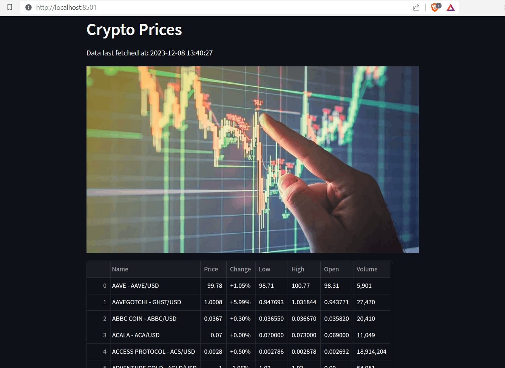
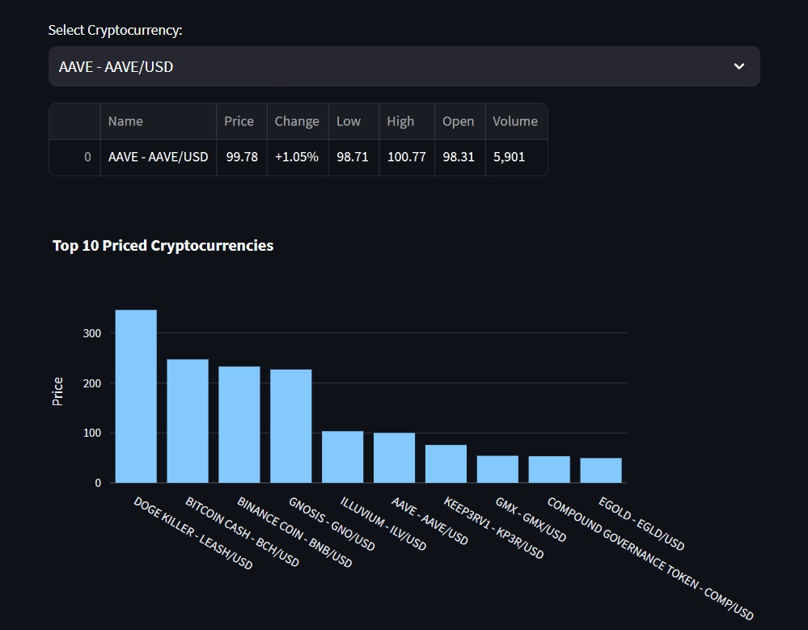

# Crypto Price Dashboard

This is a Streamlit web application that provides real-time information about various cryptocurrencies. The application scrapes data from [CentralCharts](https://www.centralcharts.com/), a website that ranks cryptocurrencies based on different metrics.Note that this only scrapes crypto prices but you can change the code to fetch any type of data for your preference





## Table of Contents

- [Introduction](#introduction)
- [Getting Started](#getting-started)
- [Features](#features)
- [Dependencies](#dependencies)
- [Usage](#usage)


## Introduction

The application is built using Python and utilizes the following libraries: NOTE THAT THIS ONLY INCLUDES THE BASIC FEATURES THAT ARE REQUIRED TO SETUP A PROJECT LIKE THIS. FEEL FREE TO EXPERIMENT BY YOURSELF

- `requests`: For making HTTP requests to the CentralCharts website.
- `BeautifulSoup` (imported as `bs`): For web scraping and parsing HTML content.
- `streamlit`: A Python library for creating web applications with minimal code.
- `pandas`: For data manipulation and analysis.
- `time`: For working with timestamps and measuring execution time.
- `plotly.express` (imported as `px`): For creating interactive visualizations.

## Getting Started

1. Clone the repository:

   ```bash
   git clone https://github.com/SaviNimz/crypto-price-webscraper.git

2. Install the required dependencies:

    ```bash
    pip install -r requirements.txt

3. Run the Streamlit app:

    ```bash
    streamlit run scraper.py

## Features

Real-time data: The application fetches live data from CentralCharts.
Data visualization: Interactive bar charts and pie charts provide insights into cryptocurrency prices and volumes.
User-friendly interface: Streamlit allows for easy filtering and exploration of cryptocurrency data.

## dependencies

requests
beautifulsoup4
streamlit
pandas
plotly

## usage

Upon running the application, you will see a header indicating "Crypto Prices" and the last fetch time.
An image of a cryptocurrency is displayed (crypto.png).
The main table shows information about various cryptocurrencies.
Use the dropdown menu to select a specific cryptocurrency and view detailed information.
A bar chart displays the top 10 priced cryptocurrencies.

You can add more charts and add more functionalities by your preferance
